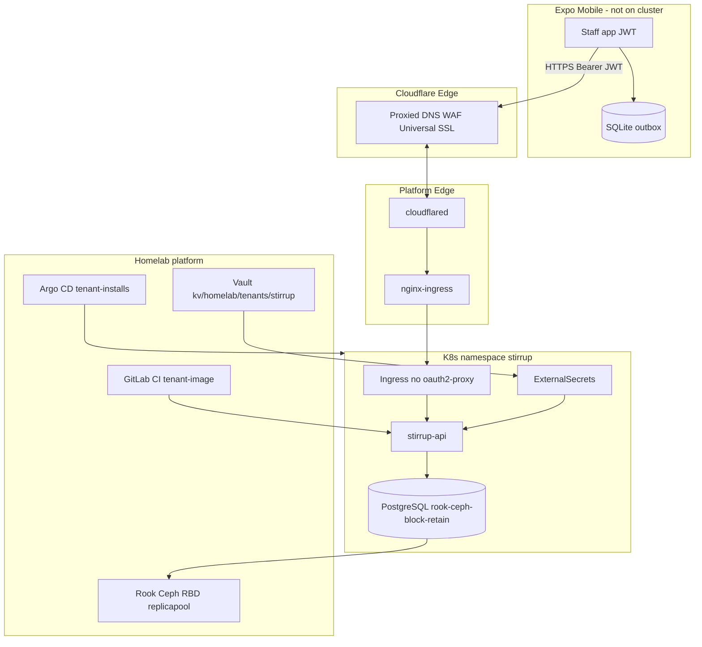

# Platform context

## Scope

**Stirrup** — single-barn equine management mobile app for boarding/training operations. Primary value: Care-to-Cash automation (point-of-care billing capture).

## Architecture

## Stack (planned)

| Layer | Choice | Notes |
|-------|--------|-------|
| Monorepo | pnpm workspaces | `apps/api`, `apps/mobile`, `packages/shared` |
| API | TypeScript (Fastify or Hono — TBD) | arm64 container |
| DB | PostgreSQL 16 StatefulSet | PVC `rook-ceph-block-retain` 5Gi; not local-path |
| Migrations | Drizzle or Flyway (TBD) | K8s Job on deploy |
| Mobile | Expo SDK 52+ | EAS internal distribution |
| Offline | expo-sqlite outbox | Minimal local schema |
| Shared types | Zod | API contract in `packages/shared` |
| Secrets | Vault + ESO | `vault-tenant` SecretStore; no secrets in git |
| Edge connectivity | Cloudflare Tunnel | Primary; WAN port-forward fallback |
| Edge auth | JWT in API | No oauth2-proxy on tenant Ingress |
| Ingress | nginx via tunnel | `stirrup.reeves.racing`; Cloudflare Universal SSL |
| CI | Platform tenant kit | `tenant-guardrails`, `tenant-image` |
| Backup | pg_dump CronJob | Phase 0 (MP-0.13); restore drill Phase 7 |

## Homelab integration

| Item | Value |
|------|-------|
| Tenant slug | `stirrup` |
| Ingress host | `stirrup.reeves.racing` |
| DNS | Cloudflare proxied CNAME → tunnel; Pi-hole split-horizon → `192.168.1.15` (LAN) |
| Registry | `registry.reeves.racing` (GitLab canonical; GHCR retired 2026-06-01) |
| Target arch | `arm64` |
| Namespace policy | `medium` tier — requests 512Mi / limits 1Gi memory; 4 PVCs; 20 pods |
| PSA | `baseline` (default at onboarding) |
| Postgres storage | `rook-ceph-block-retain` (RBD RWO Retain; platform MR MP-0.12) |
| NetworkPolicy | Platform-owned in `tenants/bundles/stirrup/`; requires 5432 egress (MP-0.11) |
| Pod label | `app.kubernetes.io/part-of: stirrup` (required) |
| Platform templates | [k3s-homelab-platform/tenants/templates](https://gitlab.reeves.racing/homelab/k3s-homelab-platform/tree/main/tenants/templates) |

## v1 non-goals

- Payment processor (Stripe)
- Accounting export (QuickBooks)
- Client booking portal
- Medical records
- Public app store release (internal EAS builds OK)
- oauth2-proxy Google SSO on tenant API (admin surfaces only)
