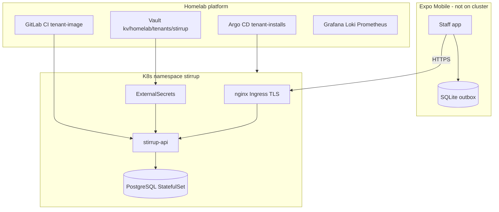

# Platform context

## Scope

**Stirrup** — single-barn equine management mobile app for boarding/training operations. Primary value: Care-to-Cash automation (point-of-care billing capture).

## Architecture

## Stack (planned)

| Layer | Choice | Notes |
|-------|--------|-------|
| Monorepo | pnpm workspaces | `apps/api`, `apps/mobile`, `packages/shared` |
| API | TypeScript (Fastify or Hono — TBD) | arm64 container |
| DB | PostgreSQL 16 StatefulSet | Tenant PVC on Rook Ceph |
| Migrations | Drizzle or Flyway (TBD) | K8s Job on deploy |
| Mobile | Expo SDK 52+ | EAS internal distribution |
| Offline | expo-sqlite outbox | Minimal local schema |
| Shared types | Zod | API contract in `packages/shared` |
| Secrets | Vault + ESO | No secrets in git |
| Ingress | nginx + cert-manager | `stirrup.reeves.racing` |
| CI | Platform tenant kit | `tenant-guardrails`, `tenant-image` |

## Homelab integration

| Item | Value |
|------|-------|
| Tenant slug | `stirrup` |
| Ingress host | `stirrup.reeves.racing` |
| DNS | Pi-hole → ingress VIP `192.168.1.15` |
| Registry | `registry.reeves.racing` (canonical — confirm vs legacy GHCR) |
| Target arch | `arm64` |
| Namespace policy | `medium` tier — 4 PVCs, 512Mi–1Gi memory budget |
| Platform templates | [k3s-homelab-platform/tenants/templates](https://github.com/Krytos13/k3s-homelab-platform/tree/main/tenants/templates) |

## v1 non-goals

- Payment processor (Stripe)
- Accounting export (QuickBooks)
- Client booking portal
- Medical records
- Public app store release (internal EAS builds OK)
