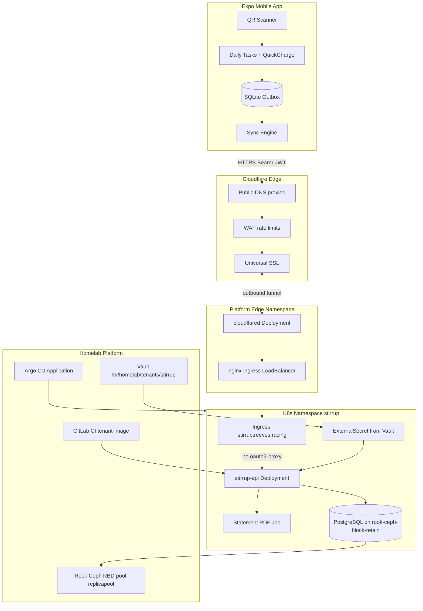
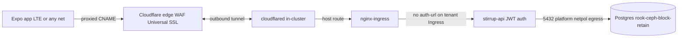
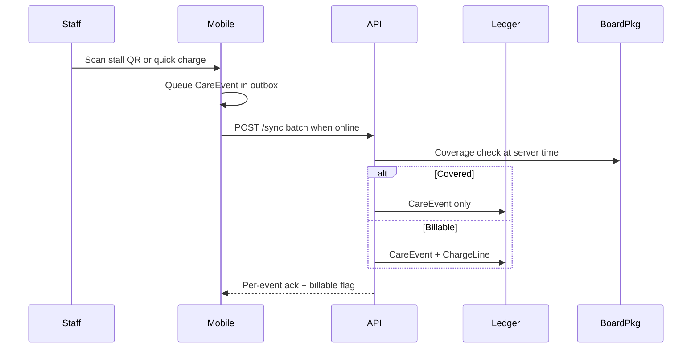
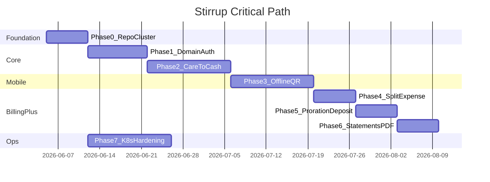

# Stirrup Barn Manager — Master Implementation Plan

**Version:** 1.1  
**Repo:** [stirrup](https://github.com/Krytos13/stirrup) (CI/registry: GitLab `registry.reeves.racing`)  
**Platform:** [k3s-homelab-platform](https://gitlab.reeves.racing/homelab/k3s-homelab-platform) tenant GitOps  
**Mini-plan index:** [plans.md](plans.md)

---

## Executive summary

Stirrup is a barn management mobile app whose non-negotiable feature is **Care-to-Cash automation**: staff log care at the stall; the system decides if the service is included in base board or billable; billable work appends to the client ledger immediately.

**v1 locked:**
- **Mobile:** Expo/React Native (EAS internal builds)
- **Billing:** Internal ledger + monthly statement PDFs (no Stripe/QB)
- **Runtime:** API + PostgreSQL in homelab tenant namespace `stirrup`
- **Connectivity:** Cloudflare Tunnel (free) → nginx-ingress; WAN port-forward as fallback
- **Edge auth:** App-level JWT on `/api`; no oauth2-proxy on tenant Ingress
- **Postgres storage:** Ceph RBD `rook-ceph-block-retain` (platform StorageClass)

**Critical path:** Phase 0 → Phase 1 schema → Phase 2 Care-to-Cash API proof → Phase 3 offline mobile → Phases 4–6 billing completeness → Phase 7 hardening (parallel after Phase 0).

---

## North star: Care-to-Cash

### The problem (whiteboard leak)

$15–$50 services performed daily — blanket changes, extra lunges, supplements — are logged on whiteboards or group texts and never invoiced. Industry loss: **10–20%** of potential revenue.

### The solution

```
[Staff completes care]
        │
        ▼
[Mobile: checklist / QR scan / quick charge]
        │
        ▼
[Server: is service covered by active BoardPackage?]
        │
        ├── Yes → CareEvent only (audit trail)
        └── No  → CareEvent + ChargeLine on client ledger
```

### Three pillars (v1 scope)

| Pillar | Phase | MVP slice |
|--------|-------|-----------|
| Care-to-Cash capture | 2, 3 | Task checkoff + quick charge + offline sync |
| Split-expense invoicing | 4 | Equal split across horses/clients |
| QR + offline mobile | 3 | Stall QR → context → outbox sync |
| Pro-ration + deposits | 5 | Calendar-month proration; deposit tracking |
| Monthly statements | 6 | Generate, review, finalize, PDF |

---

## Architecture



### Mobile to cluster connectivity

Staff phones reach the API over the public internet via **Cloudflare Tunnel** (free tier). The mobile app never talks to Kubernetes directly — only HTTPS to `https://stirrup.reeves.racing/api` with `Authorization: Bearer <JWT>`.



| Layer | Responsibility |
|-------|----------------|
| **Mobile** | Offline outbox; sync batch POST `/sync`; JWT in Expo SecureStore |
| **Cloudflare** | Public DNS, proxied orange-cloud, WAF, rate limits, Universal SSL at edge |
| **cloudflared** | Outbound tunnel to nginx-ingress; no inbound port-forward required |
| **nginx-ingress** | Host routing `stirrup.reeves.racing` → stirrup-api Service; ssl-redirect; per-Ingress rate limits |
| **Tenant Ingress** | TLS annotation; **must not** include `auth-url` / `auth-signin` (oauth2-proxy is admin-only) |
| **stirrup-api** | JWT access 15m + refresh 30d; coverage engine; ledger writes |
| **PostgreSQL** | Single-replica StatefulSet; RWO PVC on `rook-ceph-block-retain` |

**Tunnel wiring (platform operator):** Deploy `cloudflared` in the edge AppProject; store tunnel credentials in Vault + ESO; configure a public hostname route `stirrup.reeves.racing` → `ingress-nginx-controller` Service (port 443 or 80). Existing per-host Ingress rules continue to apply — the tunnel terminates at nginx, not at stirrup-api directly.

**TLS (D-19):** Edge TLS = Cloudflare Universal SSL (client → Cloudflare). Origin traffic through the tunnel is encrypted by cloudflared. If WAN fallback is used instead, use `letsencrypt-prod-dns01` ClusterIssuer (Cloudflare DNS-01) on the tenant Ingress.

**WAN fallback:** Residential port-forward tcp/80+443 → MetalLB VIP `192.168.1.15` remains documented in `platform/deploy/internet-edge-and-tenants.md`. Use only if Cloudflare Tunnel is unavailable. Requires public Cloudflare A record and DDNS for dynamic home IP.

**oauth2-proxy isolation (D-18):** Platform oauth2-proxy gates admin surfaces (Argo, Headlamp, k3s-onboarding) via opt-in Ingress annotations. The tenant template ships **without** `auth-url`. **Never copy** the k3s-onboarding Ingress pattern onto stirrup — it gates `/api` with browser Google SSO and breaks native mobile clients (302 → Google).

### Care-to-Cash sequence



---

## Target monorepo layout

```
stirrup/
├── apps/
│   ├── api/                 # TypeScript API (Fastify or Hono)
│   └── mobile/              # Expo SDK 52+
├── packages/
│   └── shared/              # Zod schemas, coverage/proration/split math
├── k8s/
│   ├── kustomization.yaml
│   ├── api-deployment.yaml
│   ├── api-service.yaml
│   ├── postgres-statefulset.yaml   # storageClassName: rook-ceph-block-retain
│   ├── postgres-service.yaml
│   ├── ingress.yaml                # no oauth2-proxy auth-url annotations
│   ├── externalsecret-api.yaml
│   ├── externalsecret-postgres.yaml
│   ├── externalsecret-registry.yaml  # imagePullSecrets for GitLab registry
│   └── cronjob-pgdump.yaml           # logical backup; start Phase 0
│   # NetworkPolicy is platform-owned — lives in tenants/bundles/stirrup/ (operator MR)
├── scripts/
│   ├── render-manifests.sh
│   └── migrate.sh
├── homelab-tenant.yaml
├── .gitlab-ci.yml
├── package.json
├── pnpm-workspace.yaml
└── memory-bank/
```

### homelab-tenant.yaml (restore)

```yaml
tenantSlug: stirrup
renderPath: k8s
ingressHost: stirrup.reeves.racing
targetArch: arm64
ingressClass: nginx
```

### Postgres PVC and securityContext (D-20)

Platform operator adds StorageClass `rook-ceph-block-retain` (clone of `rook-ceph-block` with `reclaimPolicy: Retain`). Tenant Postgres StatefulSet pins it explicitly — cluster default is `local-path`, which must **not** be used for ledger data.

```yaml
# volumeClaimTemplate (postgres-statefulset.yaml)
storageClassName: rook-ceph-block-retain
resources:
  requests:
    storage: 5Gi
```

```yaml
# pod securityContext (postgres-statefulset.yaml) — baseline + restricted-ready
securityContext:
  runAsNonRoot: true
  runAsUser: 999          # official postgres image UID
  fsGroup: 999            # ext4 volume ownership on rook-ceph-block
  seccompProfile:
    type: RuntimeDefault
containers:
  - name: postgres
    securityContext:
      allowPrivilegeEscalation: false
      capabilities:
        drop: ["ALL"]
    resources:
      requests: { cpu: 100m, memory: 256Mi }
      limits:   { cpu: 500m, memory: 512Mi }
```

Ceph pool `replicapool`: 3× replication, `failureDomain: host` — survives loss of one Pi node. PVC delete retains RBD image (`Retain` policy); accidental namespace delete still requires operator recovery from retained volume.

---

## Platform integration contract

Verified against `k3s-homelab-platform` as of 2026-06. Stirrup implementation must align with these constraints.

### Registry and CI

| Item | Value |
|------|-------|
| Canonical registry | `registry.reeves.racing` (GitLab Container Registry) |
| GHCR | Retired 2026-06-01 — do not use |
| CI jobs | `tenant-guardrails`, `repo-hygiene`, `tenant-image` via platform `includes/` |
| Image pull | Tenant manifests need `imagePullSecrets: registry-credentials` via ESO (template ships none) |
| Target arch | `arm64` (`homelab-tenant.yaml` `targetArch`) |

### Vault and ExternalSecrets

| Item | Value |
|------|-------|
| KV path | `kv/homelab/tenants/stirrup/<secret-name>` |
| ESO `remoteRef.key` | `homelab/tenants/stirrup/<secret-name>` (no `kv/` prefix) |
| Tenant SecretStore | `vault-tenant` (namespace-scoped; auth via `vault-eso-read-token`) |
| Platform ClusterSecretStore | `vault-backend` |
| Enable at grant | `VAULT_TENANT_ESO_ENABLED=true` on k3s-onboarding grant |

Expected secrets: `homelab/tenants/stirrup/api` (JWT signing key, etc.), `homelab/tenants/stirrup/postgres` (DB creds), registry pull creds if not platform-injected.

### Namespace policy — medium tier (default)

Source: `tenants/templates/namespace-policy/tiers/medium.resourcequota.yaml`

| Quota key | Value |
|-----------|-------|
| `requests.cpu` | 2 |
| `requests.memory` | 512Mi |
| `limits.cpu` | 4 |
| `limits.memory` | 1Gi |
| `persistentvolumeclaims` | 4 |
| `pods` | 20 |
| `services` | 10 |
| `secrets` | 20 |
| `configmaps` | 30 |

No storage-size quota — only PVC count. LimitRange defaults: 500m/512Mi limit, 100m/128Mi request per container; pod max 4 CPU / 4Gi.

**Budget implication:** API + Postgres + migration Job + PDF Job must fit **512Mi requests / 1Gi limits aggregate**. Size Postgres `shared_buffers` and API heap accordingly.

### PSA and labels

| Item | Value |
|------|-------|
| PSA level | `baseline` (onboarding adds `stirrup,baseline` to `psa-namespaces.csv`) |
| Required label | `app.kubernetes.io/part-of: stirrup` on all pods (NetworkPolicy selector) |
| Restricted | Not default; Postgres securityContext above is restricted-ready if promoted later |

### NetworkPolicy (platform-owned)

Tenants **cannot** create NetworkPolicy (AppProject blacklist + `deny-risky-manifests.rego`). Baseline bundle policy is default-deny but **lacks egress to port 5432** — API → Postgres is blocked until operator MR adds a rule in `tenants/bundles/stirrup/networkpolicy.yaml`:

```yaml
# egress addition (operator MR example)
- to:
    - podSelector:
        matchLabels:
          app.kubernetes.io/name: stirrup-postgres
  ports:
    - protocol: TCP
      port: 5432
```

Ingress from nginx works via `10.42.0.0/16` (pod CIDR) already allowed in baseline.

### Storage

| Item | Value |
|------|-------|
| Cluster default SC | `local-path` — **do not use for Postgres** |
| Postgres SC | `rook-ceph-block-retain` (operator creates; RBD RWO, Retain, expandable) |
| Ceph pool | `replicapool`, replicated size 3, failureDomain host |
| Usable cluster capacity | ~830 GiB at 3× replication (~2.5 TiB raw) |

### Onboarding grant flow

1. Operator submits **grant** via k3s-onboarding → `OnboardingJob` CR.
2. Worker opens platform GitLab MR: `tenants/bundles/stirrup/` + PSA CSV row + Argo RBAC.
3. Optional tenant repo MR (`seedTenantRepo: true`; use `guardrails-only` for existing app repo).
4. ApplicationSet `tenant-installs` → `stirrup-install` → `Application/stirrup` syncs repo `k8s/`.

Recommended grant parameters:

```
namespace: stirrup
namespacePolicyTier: medium
createNamespaceIfMissing: true
ingressDomain: reeves.racing
repoPath: k8s
tenantSeedMode: guardrails-only
seedTenantRepo: true
VAULT_TENANT_ESO_ENABLED: true
```

DNS: Cloudflare proxied CNAME `stirrup.reeves.racing` → tunnel hostname; Pi-hole split-horizon `stirrup.reeves.racing` → `192.168.1.15` for LAN clients.

---

## Decision log

Resolve items by the **decide-by** phase before starting dependent mini-plans.

| ID | Decision | Options | Decide by | Status | Notes |
|----|----------|---------|-----------|--------|-------|
| D-01 | Canonical registry | GitLab `registry.reeves.racing` vs GHCR | Phase 0 | **resolved** | GitLab canonical; GHCR retired 2026-06-01 |
| D-02 | API framework | Fastify vs Hono | Phase 0 | open | Lean toward Fastify for ecosystem |
| D-03 | DB access + migrations | Drizzle vs Flyway | Phase 0 | open | Drizzle fits TS monorepo |
| D-04 | Phone → API connectivity | Cloudflare Tunnel vs WAN vs Tailscale | Phase 0 | **resolved** | Cloudflare Tunnel primary (free); WAN port-forward fallback |
| D-05 | Billing account model | Client-only vs Client + BillingAccount | Phase 1 | open | Leases/part-owners need clarity |
| D-06 | Board package shape | Flat fee + included SKUs vs tiers | Phase 1 | open | Drives coverage engine |
| D-07 | Price at charge time | Snapshot on ChargeLine vs live catalog | Phase 1 | **recommend snapshot** | Prevents retroactive invoice drift |
| D-08 | Task template anchor | Per-horse vs per-stall | Phase 1 | open | Stall-based breaks on horse move |
| D-09 | Groom auth | Individual login vs barn PIN vs device pair | Phase 1 | open | Barn UX with gloves |
| D-10 | Admin surface v1 | API-only (Bruno) vs minimal web | Phase 1 | open | Managers need CRUD before field test |
| D-11 | Unscheduled billable work | Quick Charge required vs tasks-only | Phase 2 | **recommend required** | Most leak is ad-hoc |
| D-12 | Single charge ingestion path | Sync-only vs sync + task PATCH | Phase 2 | **recommend sync-only** | Prevents double billing |
| D-13 | Server authoritative time | Device time audit-only | Phase 2 | recommend | Proration + package boundaries |
| D-14 | Charge line statuses | pending → on_statement → finalized | Phase 2 | open | Enum early; void/credit later |
| D-15 | Proration policy | Calendar month vs 30-day | Phase 5 | open | Store `billing_policy` on Barn in Phase 1 |
| D-16 | Split penny rounding | Largest remainder vs last horse absorbs | Phase 4 | open | Test fixtures required |
| D-17 | PDF generation location | In API pod vs K8s Job | Phase 6 | open | Job safer on medium quota; see D-21 engine |
| D-18 | Edge auth isolation | oauth2-proxy on Ingress vs JWT-only API | Phase 0 | **resolved** | No `auth-url` on tenant Ingress; JWT in API (MP-1.2) |
| D-19 | Edge TLS with Tunnel | Cloudflare Universal SSL vs origin LE | Phase 0 | **resolved** | Universal SSL at edge; `letsencrypt-prod-dns01` if WAN fallback |
| D-20 | Postgres storage class | local-path vs rook-ceph-block vs rook-ceph-block-retain | Phase 0 | **resolved** | `rook-ceph-block-retain` (RBD RWO Retain) + early pg_dump |
| D-21 | PDF engine | Headless Chromium vs lightweight lib | Phase 6 | **resolved** | pdf-lib or pdfkit in Job; Chromium OOM under 1Gi quota |
| D-22 | Source-of-record repo host | GitHub vs GitLab | Phase 0 | open | CI/registry on GitLab; recommend GitLab canonical for stirrup repo |

---

## Deferral matrix

How much can wait until the phase or mini-plan is actively worked.

| Phase | ~% deferrable | Safe to defer | Do not defer |
|-------|---------------|---------------|--------------|
| **0** | 55% ops | Grafana dashboards, PDF statement CronJob, full observability | Registry GitLab, arm64 CI, Vault ESO, Cloudflare Tunnel MP-0.10, platform netpol 5432 MP-0.11, retain SC MP-0.12, Postgres on rook-ceph-block-retain, pg_dump CronJob, healthz, CI kit, imagePullSecret |
| **1** | 40% | Seed polish, OIDC, mobile admin UI, full OpenAPI | Horse/Client/Stall/Service/BoardPackage/CareEvent/ChargeLine tables; roles; audit log; price snapshot; `billing_policy` field |
| **2** | 25% | Cron task scheduler, waiver UI, statement preview endpoint | Coverage engine, care→charge pipeline, idempotency, quick charge, coverage_audit |
| **3** | 50% UX | UI polish, EAS production, background sync tuning | Outbox, sync ack, QR→stall context, SecureStore tokens |
| **4** | 80% | Custom %, attendance splits, receipt upload | Equal split + atomic multi ChargeLine |
| **5** | 90%* | Deposit refund UI, auto proration triggers | `effective_range` on BoardPackage (*0% if frequent move-ins) |
| **6** | 60% | Email, reminders, fancy PDF layout, client portal | `statement_id` FK; finalize lock; basic PDF totals (pdf-lib Job per D-21) |
| **7** | 90% | Full observability stack, PSA restricted promotion | `/readyz` + backup restore test; Cloudflare WAF tuning |
| **8** | 100% | All listed nice-to-haves | — |

---

## Pitfalls register

### Platform and deployment

| # | Pitfall | Mitigation | Phase |
|---|---------|------------|-------|
| P-01 | Empty repo + stale cluster splash resources | Reconcile Argo app; delete orphan splash deployment | 0 |
| P-02 | GHCR vs GitLab registry mismatch | **Resolved:** D-01 GitLab `registry.reeves.racing` only | 0 |
| P-03 | Medium quota OOM (512Mi–1Gi) | Explicit requests/limits; small Postgres shared_buffers; lightweight PDF (D-21) | 0, 6, 7 |
| P-04 | API/Postgres start without ESO secrets | Gate deploy on SecretSynced | 0 |
| P-05 | amd64 images on arm64 Pi nodes | buildx arm64 in CI from day one | 0 |
| P-06 | Phones on LTE cannot reach API | **Resolved:** D-04 Cloudflare Tunnel public hostname; Pi-hole not required off-LAN | 0, 3 |
| P-24 | oauth2-proxy on `/api` Ingress | Never add `auth-url`; D-18 JWT-only; do not copy k3s-onboarding ingress | 0, 1 |
| P-25 | API→Postgres blocked by default netpol | Operator MR: 5432 egress in `tenants/bundles/stirrup/networkpolicy.yaml` (MP-0.11) | 0 |
| P-26 | Postgres on local-path loses data on node move | Pin `storageClassName: rook-ceph-block-retain` (D-20) | 0 |
| P-27 | Home internet/power outage blocks sync | Offline outbox survives; set pilot uptime expectations; Tunnel resilient to IP change | 0, 3 |
| P-30 | cloudflared not yet deployed | MP-0.10 platform edge app; tunnel creds in Vault/ESO | 0 |

### Domain and Care-to-Cash

| # | Pitfall | Mitigation | Phase |
|---|---------|------------|-------|
| P-07 | Board package ambiguity (partial includes) | coverage_audit; manager waivers; iterate catalog | 1, 2 |
| P-08 | Wrong client billed (lease vs owner) | Resolve D-05; billing account on ChargeLine | 1, 2 |
| P-09 | Ad-hoc work not in task templates | MP-2.4 Quick Charge | 2 |
| P-10 | Retroactive package edits corrupt ledger | Immutable ChargeLine; void/credit workflow (Phase 6) | 2, 6 |
| P-11 | Double billing (sync + task PATCH) | D-12 single ingestion path | 2 |
| P-12 | Device clock skew | D-13 server authoritative `completed_at` | 2 |

### Mobile and offline

| # | Pitfall | Mitigation | Phase |
|---|---------|------------|-------|
| P-13 | Stale offline cache after manager edits | Config version + “reconnect to refresh” banner | 3 |
| P-14 | Horse moved stalls; QR on door | Resolve current horse by stall_id at read time | 3 |
| P-15 | Full ERD mirrored in SQLite | Minimal cache + outbox only | 3 |
| P-16 | EAS provisioning overhead | Budget Apple/Google setup in MP-3.4 | 3 |
| P-29 | JWT refresh expires during long offline | 30d refresh token; outbox queues care events; re-auth banner on reconnect | 3 |

### Billing extensions

| # | Pitfall | Mitigation | Phase |
|---|---------|------------|-------|
| P-17 | Split rounding ≠ total | D-16 penny algorithm + tests | 4 |
| P-18 | Proration edge cases (Feb, 31st) | MP-5.1 exhaustive fixtures | 5 |
| P-19 | Finalize without void path | Credit note status enum early | 6 |
| P-20 | PDF OOM in API pod | D-17 separate Job; D-21 pdf-lib/pdfkit not Chromium (P-28) | 6 |
| P-28 | Headless Chromium PDF Job OOM | Lightweight PDF lib; cap Job memory 256Mi | 6 |

### Process

| # | Pitfall | Mitigation | Phase |
|---|---------|------------|-------|
| P-21 | Mobile before catalog configured | MP-1.3 admin before field test | 1, 3 |
| P-22 | Mobile before API care-to-cash proof | Phase 2 gate before Phase 3 sync | 2, 3 |
| P-23 | Schema churn | Freeze MP-1.1a; nullable FKs for Phase 4–5 tables | 1 |

---

## Phase 0 — Foundation and cluster footing

**Goal:** CI green, API placeholder at `https://stirrup.reeves.racing/healthz` (via Cloudflare Tunnel), Postgres PVC bound on `rook-ceph-block-retain`, pg_dump CronJob scheduled.

| Step | Action | Mini-plan | Acceptance |
|------|--------|-----------|------------|
| 0.1 | Re-seed from `k3s-homelab-platform/tenants/templates/repo-ci` + k8s API manifests | MP-0.1 | `tenant-guardrails` + `repo-hygiene` green |
| 0.2 | Grant/reconcile `tenants/bundles/stirrup/` via k3s-onboarding (`VAULT_TENANT_ESO_ENABLED=true`) | MP-0.2 | Argo `Application/stirrup` Synced |
| 0.3 | Cloudflare proxied CNAME `stirrup.reeves.racing` → tunnel; Pi-hole split-horizon → `192.168.1.15` | MP-0.3 | Hostname resolves LAN + LTE |
| 0.4 | Vault: `homelab/tenants/stirrup/api`, `.../postgres`; ESO SecretSynced | MP-0.4 | ExternalSecret SecretSynced |
| 0.5 | pnpm monorepo; API returns `{ status: "ok" }` | MP-0.5 | `pnpm test` in CI |
| 0.6 | Multi-stage Dockerfile arm64; push to `registry.reeves.racing`; imagePullSecret via ESO | MP-0.6 | Cluster pulls image |
| 0.7 | PostgreSQL StatefulSet on `rook-ceph-block-retain` (5Gi) + migration job | MP-0.7 | `\dt` shows migrations |
| 0.8 | Ingress `/api/*` → API; **no oauth2-proxy annotations**; verify Tunnel path | MP-0.8 | `curl /healthz` 200 from LTE |
| 0.9 | memory-bank/ | MP-0.9 | complete |
| 0.10 | Deploy cloudflared in platform edge; tunnel route → nginx-ingress | MP-0.10 | Tunnel healthy; public hostname routes |
| 0.11 | Platform MR: netpol egress 5432 API→Postgres in bundle | MP-0.11 | API `/readyz` DB ping OK |
| 0.12 | Platform MR: StorageClass `rook-ceph-block-retain` | MP-0.12 | SC available; PVC Bound Retain |
| 0.13 | pg_dump CronJob + registry ExternalSecret | MP-0.13 | CronJob succeeds; dump artifact exists |

**Resource budget:** medium tier — Postgres PVC 5Gi on Ceph retain, API 1 replica (~128Mi request), pg_dump CronJob; defer statement PDF CronJob to Phase 6.

**Parallel:** MP-0.9 done. MP-0.10 can start once edge AppProject accepts cloudflared. MP-7.1 observability can wait.

**Operator-only (platform repo):** MP-0.10, MP-0.11, MP-0.12 — not in stirrup tenant Git.

---

## Phase 1 — Domain model and identity

**Goal:** Canonical entities and RBAC before care logging.

### 1.1 Core entities

| Entity | Purpose | Key fields |
|--------|---------|------------|
| `Barn` | Single barn v1 | name, timezone, `billing_cycle_day`, `billing_policy` |
| `User` | Staff, managers, clients | email, role, optional pin |
| `Client` | Owner account | name, email, billing_address |
| `BillingAccount` | Who pays (optional v1) | client_id, label — if D-05 split |
| `Horse` | Boarded animal | name, client_id, stall_id, move_in/out |
| `Stall` | Physical stall | label, section, `qr_payload_id` UUID |
| `BoardPackage` | Base board contract | horse_id, `effective_range`, `monthly_rate`, included_services[] |
| `ServiceCatalogItem` | Billable SKU | code, label, unit_price, unit, category |
| `CareTaskTemplate` | Recurring chore | horse_id (preferred), schedule, linked_service_id |
| `CareEvent` | Point-of-care log | horse_id, service_id, worker_id, `client_generated_uuid`, source |
| `ChargeLine` | Ledger row | client_id, horse_id, service_id, **snapshot unit_price**, qty, care_event_id, statement_id, status |
| `CoverageAudit` | Dispute trail | care_event_id, covered, reason, package_id |
| `SharedExpense` | Split parent (schema only) | total, rule — Phase 4 |
| `Deposit` | Refundable hold (schema only) | client_id, horse_id, amount, status |
| `MonthlyStatement` | Invoice period (schema only) | client_id, period, status |

**Mini-plans:** MP-1.1a (migrations), MP-1.1b (Zod + contract), MP-1.1c (seed).

### 1.2 Auth

| Step | Detail |
|------|--------|
| 1.2.1 | Email/password or invite token v1; OIDC deferred MP-8.6 |
| 1.2.2 | JWT access 15m + refresh 30d; Expo SecureStore |
| 1.2.3 | Roles: `groom`, `trainer`, `barn_manager`, `client_readonly` |
| 1.2.4 | Route guards by role |
| 1.2.5 | `audit_log` on every ledger mutation |

**Mini-plan:** MP-1.2

### 1.3 Admin bootstrap

CRUD via API (Bruno/Postman or minimal web per D-10):
- clients, horses, stalls, services, board packages
- stall QR PNG: `GET /stalls/:id/qr.png`

**Mini-plan:** MP-1.3

**Phase 1 gate:** Manager creates horse + board package + service; groom account exists.

---

## Phase 2 — Care-to-Cash core (MVP)

**Goal:** Billable care → ChargeLine unless covered by BoardPackage. **Minimum shippable product.**

### 2.1 Coverage engine

```
isCovered(horse, service, atTime):
  pkg = active BoardPackage for horse where atTime in effective_range
  return service.code in pkg.included_services
```

| Step | Action |
|------|--------|
| 2.1.1 | `CoverageService` in API + vitest fixtures in `packages/shared` |
| 2.1.2 | Optional `BoardPackageExclusion` waivers |
| 2.1.3 | Insert `CoverageAudit` on every decision |

**Mini-plan:** MP-2.1

### 2.2 Care event → ledger pipeline

| Step | Action |
|------|--------|
| 2.2.1 | `POST /sync` accepts batch of care events |
| 2.2.2 | Idempotency: `client_generated_uuid` unique constraint |
| 2.2.3 | Transaction: CareEvent → coverage → optional ChargeLine with snapshot price |
| 2.2.4 | Server sets authoritative `completed_at` (D-13) |
| 2.2.5 | Response per event: `{ billable, charge_id?, reason? }` |

**Mini-plan:** MP-2.2

### 2.3 Task scheduler (deferrable slice)

| Step | Action |
|------|--------|
| 2.3.1 | Materialize `DailyTaskInstance` from templates |
| 2.3.2 | `GET /tasks/today` grouped by section |
| 2.3.3 | Completion flows through same pipeline as 2.2 |

**Mini-plan:** MP-2.3 — can slip after MP-2.2 API proof

### 2.4 Quick Charge (ad-hoc billable) — **not deferrable**

Most revenue leak is unscheduled work (extra lunge, emergency blanket).

| Step | Action |
|------|--------|
| 2.4.1 | `POST /care-events/quick` — horse + service catalog pick + optional note |
| 2.4.2 | Same coverage + charge pipeline as 2.2 |
| 2.4.3 | Mobile: Quick Charge screen from horse context (Phase 3) |

**Mini-plan:** MP-2.4

### 2.5 Manager visibility

- `GET /ledger/pending`
- `GET /clients/:id/statement-preview`

### Phase 2 acceptance test

1. Horse board package includes `am_feed` only.
2. `pm_feed` via API → ChargeLine created, price snapshotted.
3. `am_feed` → CareEvent only, no ChargeLine.
4. Duplicate `client_generated_uuid` → idempotent 200, one ChargeLine.
5. Quick charge for `extra_lunge` → ChargeLine without task template.

---

## Phase 3 — QR codes and offline mobile (Expo)

**Goal:** Stall-side QR → instructions → checkoff with zero connectivity; sync later.

### 3.1 QR design

| Item | Spec |
|------|------|
| Payload | `stirrup://stall/{qr_payload_id}` |
| Print | Manager PDF sheet from admin endpoint |
| Resolve | Current horse for stall at read time (P-14) |

**Mini-plan:** MP-3.1

### 3.2 Mobile structure

```
apps/mobile/src/
  db/              # expo-sqlite: outbox + minimal cache
  sync/            # batch POST /sync, backoff, ack
  screens/
    Login.tsx
    TodayTasks.tsx
    StallScan.tsx
    QuickCharge.tsx
    HorseDetail.tsx
    TaskComplete.tsx
  api/             # typed client from packages/shared
```

### 3.3 Offline sync protocol

| Step | Detail |
|------|--------|
| 3.3.1 | On login+network: pull snapshot (horses, stalls, tasks, catalog, packages) |
| 3.3.2 | All writes → local `outbox` first |
| 3.3.3 | Background worker POST `/sync` |
| 3.3.4 | Acks mark rows synced |
| 3.3.5 | Conflicts: server wins catalog; client wins care events (idempotent UUID) |
| 3.3.6 | Banner: `Offline — N queued` |
| 3.3.7 | `config_version` on snapshot; stale banner (P-13) |

**Mini-plans:** MP-3.3a, MP-3.3b, MP-3.3c

### 3.4 EAS distribution

| Step | Detail |
|------|--------|
| 3.4.1 | `eas.json`: development, preview, production |
| 3.4.2 | API URL: `https://stirrup.reeves.racing/api` via Cloudflare Tunnel (D-04); LAN dev may use split-horizon |
| 3.4.3 | Internal TestFlight / Play internal testing |

**Mini-plan:** MP-3.4 — can start early (parallel Phase 0.5)

### 3.5 Stall scan UX

1. Scan QR → horse name, feeding, blankets, incomplete tasks
2. Complete task → outbox + optimistic strike-through
3. Billable extra → `+$N` badge before confirm
4. Quick Charge button on horse detail

**Phase 3 gate:** Airplane mode → scan → complete → sync → ChargeLine in API.

---

## Phase 4 — Split-expense invoicing

**Goal:** One expense split across N clients automatically.

### 4.1 Split rules (v1: equal only)

| Rule | Phase |
|------|-------|
| `equal` | 4 |
| `fixed_shares` | defer |
| `by_service_attendance` | defer MP-8+ |

| Step | Action |
|------|--------|
| 4.1.1 | `POST /shared-expenses` — amount, description, horse_ids[] |
| 4.1.2 | Transaction: SharedExpense + Allocations + N ChargeLines |
| 4.1.3 | Penny rounding per D-16 |
| 4.1.4 | Manager preview before commit |

**Mini-plans:** MP-4.1, MP-4.2

**Gate:** $200 / 4 horses → 4 × $50.00 ChargeLines; sum exact.

---

## Phase 5 — Pro-ration and deposit tracking

**Goal:** Mid-month move-in/out and deposits without Excel.

### 5.1 Proration

| Step | Detail |
|------|--------|
| 5.1.1 | Daily rate from `monthly_rate / days_in_month` (calendar) |
| 5.1.2 | Move-in: prorated ChargeLine for partial month |
| 5.1.3 | Move-out: close package, prorate final days, stop tasks |
| 5.1.4 | `packages/shared/proration.ts` + vitest edge cases |

**Mini-plan:** MP-5.1

### 5.2 Deposits

| Step | Detail |
|------|--------|
| 5.2.1 | Deposit on onboarding — separate line type |
| 5.2.2 | Move-out: refunded or applied_to_invoice |
| 5.2.3 | Balance on client summary |

**Mini-plan:** MP-5.2

**Gate:** Move-in 15th → ~50% board on statement; deposit separate.

---

## Phase 6 — Monthly statements (ledger → PDF)

| Step | Action |
|------|--------|
| 6.1 | Aggregate ChargeLines where `statement_id IS NULL` and in period |
| 6.2 | `POST /statements/generate?period=YYYY-MM` |
| 6.3 | Review grouped by horse |
| 6.4 | `POST /statements/:id/finalize` — lock lines |
| 6.5 | PDF via K8s Job using pdf-lib/pdfkit (D-21); not headless Chromium |
| 6.6 | `GET /statements/:id.pdf` |
| 6.7 | CronJob reminder on `billing_cycle_day` — defer |

**Mini-plans:** MP-6.1, MP-6.2, MP-6.3 (portal defer)

**Gate:** Month of care → finalize → PDF total = sum(ChargeLines).

---

## Phase 7 — Kubernetes production hardening

| Step | Action |
|------|--------|
| 7.1 | PSA: default **baseline** (onboarding); optional promotion to restricted if Postgres securityContext already hardened |
| 7.2 | NetworkPolicy review: ingress→API, API→Postgres only (baseline from MP-0.11) |
| 7.3 | Resource requests/limits all pods |
| 7.4 | `/healthz`, `/readyz` (DB ping) |
| 7.5 | JSON logs → Loki |
| 7.6 | Prometheus: `care_events_total`, `charge_lines_created`, `sync_batch_duration` |
| 7.7 | pg_dump restore drill (CronJob lives from MP-0.13); Velero optional |
| 7.8 | Migration Job on deploy |
| 7.9 | Cloudflare WAF rules + rate limits on `stirrup.reeves.racing` |

**Mini-plans:** MP-7.1, MP-7.2 (restore drill)

**Minimum before pilot with real data:** 7.4 + one successful backup restore test (pg_dump from MP-0.13).

---

## Phase 8 — Explicitly deferred

| ID | Feature |
|----|---------|
| MP-8.1 | Client booking portal |
| MP-8.2 | Medical records |
| MP-8.3 | Calendar / scheduling |
| MP-8.4 | Stripe / payment links |
| MP-8.5 | QuickBooks export |
| MP-8.6 | Google OIDC staff login |
| MP-8.7 | Push notifications |
| MP-8.8 | Photo attach on care events |

---

## API surface (contract sketch)

Freeze in MP-1.1b (`packages/shared`).

| Group | Endpoints |
|-------|-----------|
| Health | `GET /healthz`, `GET /readyz` |
| Auth | `POST /auth/login`, `POST /auth/refresh` |
| Sync | `POST /sync` |
| Tasks | `GET /tasks/today`, `PATCH /tasks/:id/complete` (must use sync pipeline) |
| Stalls | `GET /stalls/:qr_id/context`, `GET /stalls/:id/qr.png` |
| Care | `POST /care-events/quick` |
| Admin | CRUD `/clients`, `/horses`, `/stalls`, `/services`, `/board-packages` |
| Ledger | `GET /ledger`, `GET /clients/:id/statement-preview` |
| Billing | `POST /shared-expenses`, `POST /statements/generate`, `POST /statements/:id/finalize`, `GET /statements/:id.pdf` |

---

## Build order (Gantt)



**Parallel tracks:**
- Phase 7 after Phase 0.7 (Postgres live); backup CronJob starts Phase 0 (MP-0.13)
- MP-0.10 Cloudflare Tunnel before mobile field test (Phase 3)
- Mobile UI mockups during Phase 2 if API contract frozen
- MP-3.4 EAS setup during Phase 0.5
- Phases 4–5 swappable by barn urgency

---

## Testing strategy

| Layer | Tool | Focus |
|-------|------|-------|
| shared | vitest | coverage, proration, split rounding |
| api | vitest + supertest | idempotency, ledger atomicity, coverage_audit |
| mobile | jest | outbox, QR parse, offline queue |
| e2e | manual barn script | Phase 3 airplane-mode gate |
| k8s | `validate-locally.sh` | conftest tenant policies |

---

## Mini-plan spin-off catalog (full index)

| ID | Name | Depends | Delivers |
|----|------|---------|----------|
| MP-0.1 | Repo re-seed | — | CI kit + k8s skeleton |
| MP-0.2 | Tenant bundle reconcile | MP-0.1 | Argo healthy |
| MP-0.3 | DNS | MP-0.2 | Hostname resolves |
| MP-0.4 | Vault secrets | MP-0.2 | ESO synced |
| MP-0.5 | Monorepo scaffold | MP-0.1 | pnpm workspaces |
| MP-0.6 | Container pipeline | MP-0.5 | arm64 image |
| MP-0.7 | Postgres | MP-0.4, MP-0.6 | migrations |
| MP-0.8 | Ingress | MP-0.6, MP-0.10 | TLS API via Tunnel |
| MP-0.9 | Memory bank | — | docs |
| MP-0.10 | Cloudflare Tunnel | MP-0.2 | public hostname → nginx |
| MP-0.11 | Platform netpol 5432 | MP-0.2 | API→Postgres egress |
| MP-0.12 | rook-ceph-block-retain SC | — | Retain RBD class |
| MP-0.13 | pg_dump CronJob | MP-0.7 | logical backup |
| MP-1.1a | ERD migrations | MP-0.7 | schema v001 |
| MP-1.1b | Shared types | MP-1.1a | Zod + contract |
| MP-1.1c | Seed data | MP-1.1a | demo barn |
| MP-1.2 | Auth API | MP-1.1a | JWT |
| MP-1.2m | Mobile login | MP-1.2, MP-3.4 | Expo auth |
| MP-1.3 | Admin API | MP-1.2 | CRUD |
| MP-2.1 | Coverage engine | MP-1.1a | board rules |
| MP-2.2 | Care-to-Cash pipeline | MP-2.1 | **core** |
| MP-2.3 | Task scheduler | MP-1.1a | daily tasks |
| MP-2.4 | Quick Charge | MP-2.2 | ad-hoc billable |
| MP-3.1 | QR kit | MP-1.3 | printable codes |
| MP-3.3a | SQLite schema | MP-1.1b | offline DB |
| MP-3.3b | Sync engine | MP-2.2, MP-3.3a | outbox |
| MP-3.3c | StallScan UI | MP-3.1, MP-3.3b | scan flow |
| MP-3.4 | EAS pipeline | MP-0.5 | installable app |
| MP-4.1 | Split engine | MP-2.2 | shared expenses |
| MP-4.2 | Split UI | MP-4.1 | manager review |
| MP-5.1 | Proration lib | MP-1.1b | move-in/out |
| MP-5.2 | Deposits | MP-5.1 | deposit tracking |
| MP-6.1 | Statement aggregator | MP-2.2 | monthly close |
| MP-6.2 | PDF template | MP-6.1 | client PDF (pdf-lib Job) |
| MP-6.3 | Client portal | MP-6.2 | read-only |
| MP-7.1 | Observability | MP-0.8 | dashboards |
| MP-7.2 | Backup restore drill | MP-0.13 | pg_dump restore test |

---

## First execution wave

When implementation begins, pull mini-plans in this order:

1. **MP-0.12 + MP-0.10 + MP-0.11** — Platform operator: retain StorageClass, Cloudflare Tunnel, netpol 5432 (can batch)
2. **MP-0.1 + MP-0.5** — Re-seed repo, pnpm monorepo, `homelab-tenant.yaml`
3. **MP-0.2 → MP-0.8 + MP-0.13** — Tenant bundle, DNS, Vault ESO, Postgres on retain SC, ingress, pg_dump
4. **Resolve D-02 through D-10, D-22** — Before MP-1.1a schema freeze (D-01, D-04, D-18–D-21 resolved)
5. **MP-1.1a + MP-1.2 + MP-1.3** — Schema, JWT auth, admin CRUD
6. **MP-2.1 + MP-2.2 + MP-2.4** — Care-to-Cash + Quick Charge API proof
7. **MP-3.4** (parallel) — EAS project setup
8. **MP-3.3a → MP-3.3c + MP-3.1** — Offline mobile field test (requires MP-0.10 Tunnel)

Do **not** start Phase 3 sync until Phase 2 acceptance test passes.

---

## Document maintenance

| Event | Update |
|-------|--------|
| Mini-plan started | `plans.md` status → `in_progress` |
| Mini-plan done | `progress.md` first, then `plans.md`, then `active-context.md` |
| Decision resolved | Decision log status in this doc |
| New pitfall discovered | Pitfalls register |
| Phase 8 item promoted | Move to phases 1–7; add mini-plan row |
